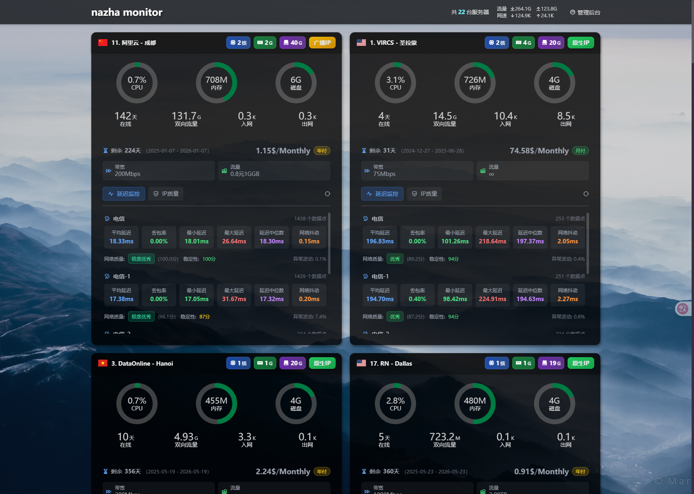
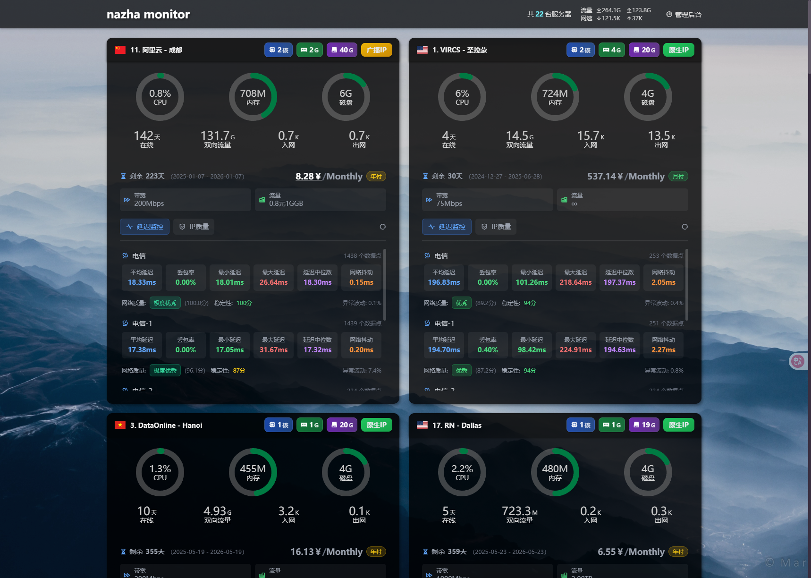
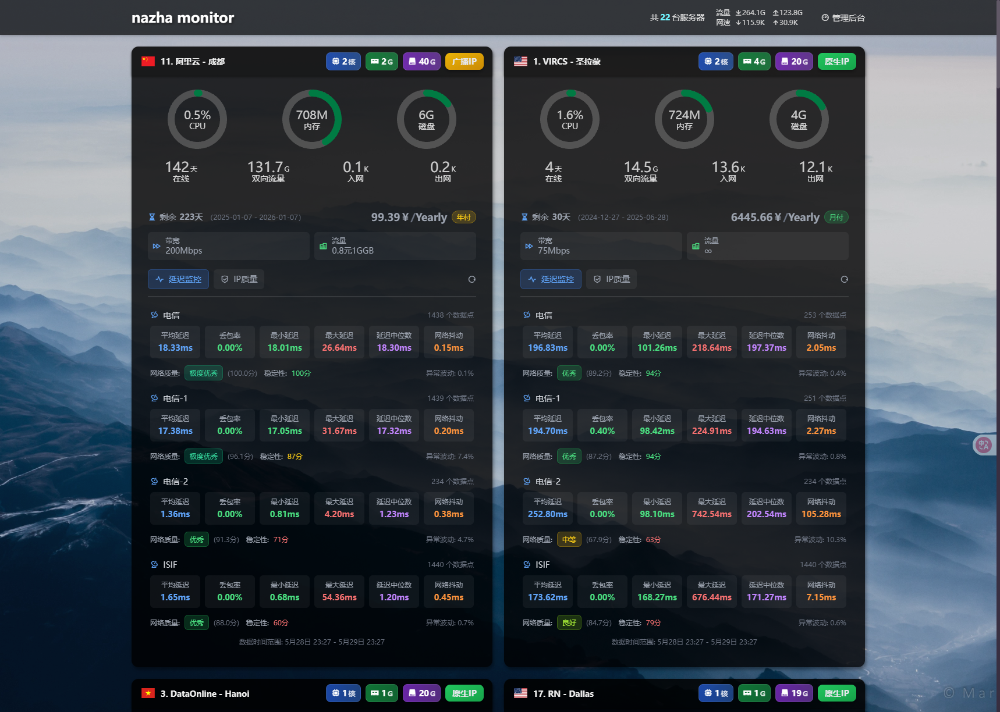
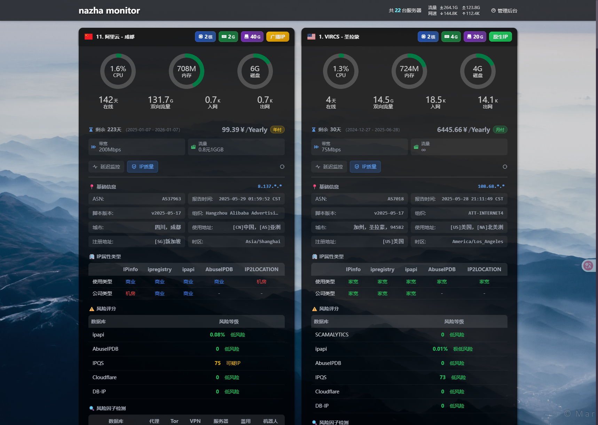
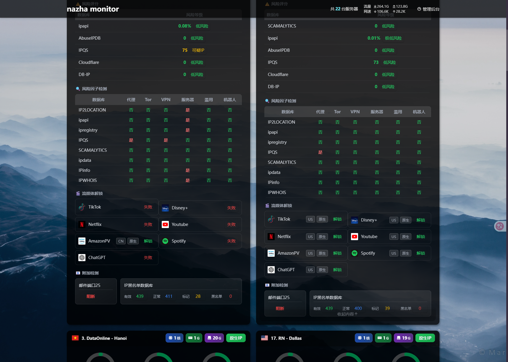

# nazhua-customize
基于nezha v1监控的nazhua主题进行定制

## 图













## 食用方式
- 构建服务器信息，结构如下所示：
```ts
interface IServerInfo {
    /**
     * 与 nezha 后台服务器中的ID属性对应
     */
    id: number
    /**
     * 自定义名称，会替换掉首页中头部的内容
     */
    name: string
    /**
     * 账单信息
     */
    billing: {
        /**
         * 购入时间
         */
        startDate: string
        /**
         * 到期时间
         * 为空时，显示"免费"
         */
        endDate?: string
        /**
         * 是否为月付
         */
        month?: true
        /**
         * 是否为年付
         */
        year?: true
        /**
         * 是否为免费购入
         */
        free?: true
        /**
         * 每月的费用，单位: "美元"
         * 可在界面中点击金额切换为"人民币"，会自行获取最新汇率进行换算
         * 为保持统一，若为年付或非美元结算时，请自行换算为月付美元金额
         */
        amount?: number
    }
    /**
     * 带宽大小，单位：Mbps
     * 超过 1000 Mbps 界面上会自行换算为 Gbps
     */
    bandwidth: number
    /**
     * 可用流量，单位：GB
     */
    trafficVol?: number
    /**
     * IP质量检测后生成的 hash 数组
     * 
     * 目前仅针对 bash <(curl -sL IP.Check.Place) -y 脚本生成后的 hash 有效
     */
    ipCheckReportHash?: string[]
}

```
- 替换掉自定义代码中的 `window.__ServerInfo` 变量. （别问为啥不用公用备注，哪吒后台那弹框我无力吐槽，维护那东西得麻烦死）
- 在后台 `系统设置` 中切换 `主题` 为 `Nazhua`
- 复制项目根目录 `nezha.hmtl` 中的内容到 `自定义代码（样式和脚本）` 中
- 保存，然后刷新前台首页...

### 自建服务
- 目前代码中使用的图标来源于我自己的静态服务 `static.08310507.xyz` 托管的图片我已经放在 `images` 目录下，可自行假设静态服务进行替换.
- `ipq.08310507.xyz` 是我托管在 `cloudflare` 的 `workers`， 主要用于解析 `IP质量检测 bash <(curl -sL IP.Check.Place) -y` 脚本生成后的 hash，将其转换为 `json` 格式数据
    > IP质量检测脚本本身提供了导出 json 的参数，但若是使用那份文件的话，整个操作过程就会很复杂（得先将导出的 json 放到静态服务里（下载 -> 上传），然后改配置），或者难以维护（直接将导出的 json放到配置里...）

    > 目前没那么麻烦，直接使用 `nezha` 后台的 `terminal` 跑完脚本，复制 hash，加个配置就行


---

暂时就这样了.能满足我个人需求了...有空了再折腾加点别的东西...比如把延迟图也放到首页、加入 `NodeQuality`、`融合怪`、`bash.spiritlhl.net/ecs-ipcheck` 等脚本的支持、改进为使用懒加载......